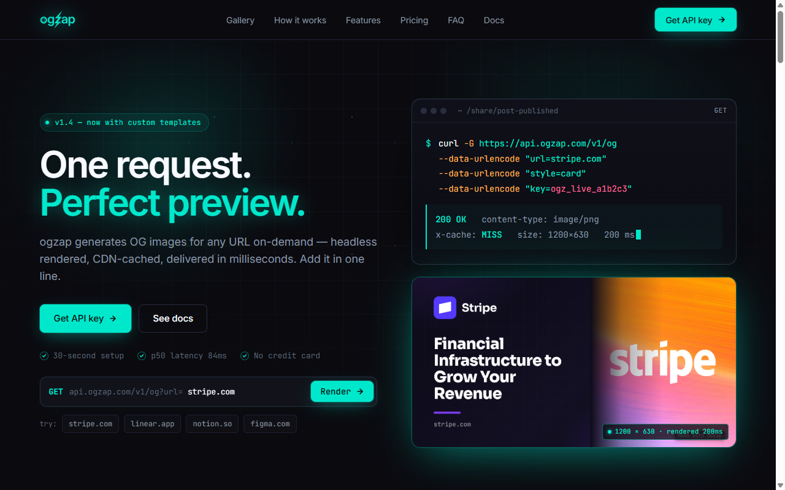

<div align="center">

# OGzap

**Dynamic Open Graph images for any URL — one request, a branded preview card**

[ogzap.com](https://ogzap.com)&nbsp;&nbsp;·&nbsp;&nbsp;[](https://ogzap.com)&nbsp;&nbsp;[](#)&nbsp;&nbsp;[](#)

</div>

---

## The problem

Every page you share needs an Open Graph image, or it looks dead in the feed. Building that infrastructure yourself — headless browser, templates, brand extraction, caching — is a project on its own. So most people ship a generic logo, or nothing.

## What OGzap does

One endpoint turns any URL into a branded 1200×630 preview card.

```
https://ogzap.com/og?url=https://yoursite.com&customer=YOUR_KEY
```

```
request URL → extract brand (logo, color, font) → render card → cached forever
```

Drop the result in `<meta property="og:image">`. No design step, no infra to run.

> One request. Perfect preview.

---

## Screens

<div align="center">

</div>

---

## Roadmap

- [x] Screenshot mode — real page capture via in-process serverless Chromium
- [x] Designed card mode — brand color, logo & font auto-extracted from the page
- [x] Anti-bot / heavy-SPA hardening with an always-clean fallback card
- [x] Free (100 renders/mo) + Pro (unlimited), API-key auth — no account friction
- [x] Paddle billing with webhook-synced plans (incl. refund revocation)
- [ ] Custom card templates
- [ ] Team accounts & usage analytics

## How it's built

A single headless Chromium launch (`@sparticuz/chromium` + `puppeteer-core`) runs **inside the Vercel function** — no external screenshot service to keep alive.

For card mode it loads the target page and reads its real brand signals in-browser — `theme-color`, the heading's computed font and its webfont source, `apple-touch-icon` as the logo, `og:image` as the hero — then renders a designed template around them.

Results cache at the edge for a year; any failure falls back to a clean host-only card instead of erroring.

## Stack

Next.js · Neon · Paddle · Resend · serverless Chromium (puppeteer-core) · Vercel

---

<div align="center">

*Try it live →* [ogzap.com](https://ogzap.com)

</div>
